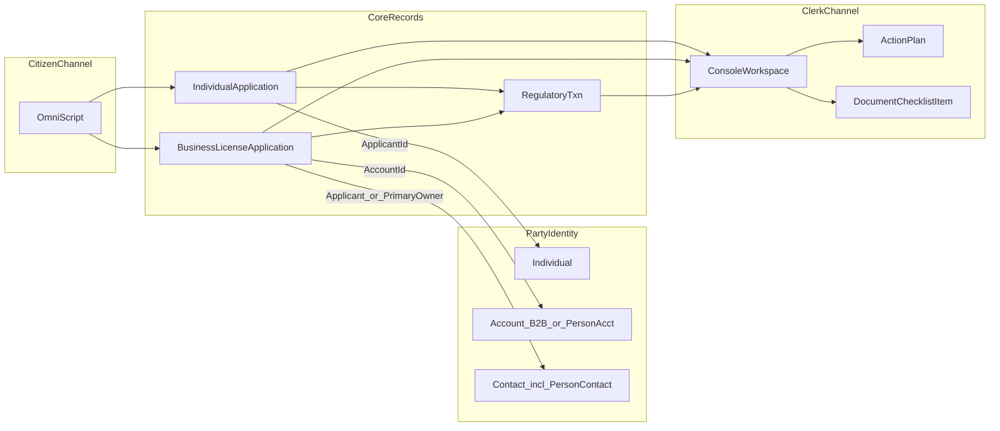

# Public Sector Solutions (PSS) Implementation Plan: State and Local Government

> **Scope:** This plan describes how citizens and businesses **complete forms and checklists** to request **benefits, licenses, permits**, and other regulated services, using native PSS objects. Sample metadata in this repository may still use **legacy placeholder** `DeveloperName` values—rename in your org to match your **`RegulatoryAuthorizationType`** and **`ActionPlanTemplate`** keys.

## Guiding Principles

- **Native PSS objects only** — Anchor service requests on the **correct application parent** for the scenario, then on shared regulatory and checklist objects. Use **`IndividualApplication`** when the **applicant is a person** (`ApplicantId` → `Individual`)—for example benefits, many personal permits, and program intake where the filing is citizen-centric. Use **`BusinessLicenseApplication`** for **business license** apply or renew: it is the native filing spine—**`AccountId`** → **`Account`** (B2B **Account** or **Person Account** for sole proprietors) and **`ApplicantId`** / **`PrimaryOwnerId`** → **`Contact`** (including **PersonContact** for Person Accounts) per the PSS object model—**do not** substitute **`IndividualApplication`** as the primary record for that case. Owners or agents may still appear on **`RegulatoryTxnParty`** or related roles per Object Manager. For either path, use **`RegulatoryTxn`**, **`ApplicationForm`** / **`ApplicationFormSection`** / **`ApplicationFormField`** (confirm which parent your release attaches forms to), **`RegulatoryTxnParty`**, **`DocumentChecklistItem`**, and **`ActionPlanTemplate`** / **`ActionPlan`** / **`RecordAction`** as applicable. Do not introduce custom objects for standard application, regulatory, document, or checklist capabilities covered by PSS and the Industries common layer.
- **OmniStudio for all citizen-facing intake** — Residents and external partners use OmniScript on Experience Cloud for guided capture, uploads, and submission; no custom **Lightning Web Components (LWC)** portal for standard intake patterns.
- **Party / Individual as constituent identity spine** — Resolve applicants and related persons to `Individual` and `Party` where that is your person-program model; use `ContactPointAddress`, `ContactPointPhone`, and `ContactPointEmail` for structured addresses and channels; use `Account` for organizational parties (sponsor, employer, provider agency, **licensed business**, or **Person Account** where your org uses that pattern) as appropriate.
- **Compliant Data Sharing (CDS) from day one if sensitive data is involved** — If legal and product confirm purpose-limited access, cross-program sharing of sensitive **personally identifiable information (PII)**, or Community users needing CDS-protected data, provision `DataUsePurpose`, `AuthorizationFormConsent`, `IndividualShare`, and related CDS patterns in Phase 1 alongside Experience Cloud tiering (e.g. Customer Community Plus). If CDS is out of scope for **minimum viable product (MVP)**, document the waiver, deliver strict **field-level security (FLS)** and **organization-wide defaults (OWD)** and audit via `InteractionSummary`, and define explicit criteria for a future CDS cut-in.

**Related architecture:** [docs/adr-pss.md](adr-pss.md).

*Diagram: **`IndividualApplication`** uses **`Individual`** for the person applicant. **`BusinessLicenseApplication`** uses **`Account`** (business or Person Account) plus **`Contact`** lookups for submitter/primary owner. Validate **`AccountId`**, **`ApplicantId`**, **`PrimaryOwnerId`**, **`LicensedEntity`**, and **`ApplicationForm`** parents in Object Manager for your PSS release.*

---

## Phase 1: Foundation

### What we build first and why

Establish **identity**, **security**, and the **metadata spine** so every later phase attaches to the same patterns: `Individual` / `Party`, baseline `ApplicationType` and `RegulatoryAuthorizationType` records, Experience Cloud access, a minimal citizen OmniScript that persists a draft filing, and a clerk workspace to open the same records. This phase intentionally avoids full agency form parity so Phase 2 can deliver the first complete vertical slice (one high-volume service path) on a stable platform.

### Objects configured

| Area | Objects / configuration |
|------|-------------------------|
| Identity | `Individual`, `Party`; optional `PartyProfile` |
| Channels | `ContactPointAddress`, `ContactPointPhone`, `ContactPointEmail` |
| Organizations | `Account` (B2B **or** **Person Account** per org policy) for partner agencies, employers, sponsors, **licensed businesses**, sole proprietors, or vendors as needed |
| Applications | `ApplicationType` records for each major service program you offer; plan which programs use **`IndividualApplication`** (person applicant) vs **`BusinessLicenseApplication`** (business license apply/renew) |
| Business licensing | Where in scope: **`BusinessLicenseApplication`** with **`AccountId`**, **`ApplicantId`**, **`PrimaryOwnerId`** (see Guiding Principles) and related **`BusinessLicense`** / **`LicenseType`** / **`LicensedEntity`**—not modeled on **`IndividualApplication`** alone |
| Regulatory | `RegulatoryAuthorizationType` **stubs** (metadata only or minimal records)—**examples:** `Benefit_NewApplication_SLG`, `Permit_Initial_SLG`, `LicenseRenewal_SLG` (use your program’s API names; replace any placeholder keys shipped with this template) |
| Forms | Minimal `ApplicationForm` / `ApplicationFormSection` / `ApplicationFormField` shell and **naming standards** (`DeveloperName` conventions for reporting) |
| Documents | Optional: parent polymorphism design for `DocumentChecklistItem` (application vs regulatory txn) |
| Citations | `RegulatoryCode` seed deferred to Phase 3 unless training needs require early load |

### OmniScripts built

- Experience Cloud **site shell** and authentication handoff (login / registration per org policy).
- **One minimal citizen OmniScript** (person path): start or resume a draft **`IndividualApplication`**, bind primary applicant to **`Individual`**, capture basic contact/address into `ContactPoint*`, set `ApplicationType` and intended `RegulatoryAuthorizationType` (or equivalent routing field), save **Draft** — not full checklist or agency-form parity.
- **Optional second minimal script or branch** (business license path): start or resume a draft **`BusinessLicenseApplication`**; set **`AccountId`** (business **Account** or **Person Account**), **`ApplicantId`** / **`PrimaryOwnerId`** (**`Contact`** / **PersonContact**), license type and routing, save **Draft** — same portal and security patterns as the person path; confirm in Object Manager how **`ApplicationForm`** (or equivalent) attaches to **`BusinessLicenseApplication`** in your API version.

### Flows automated

- **Record-triggered or subflow**: on **`IndividualApplication`** or **`BusinessLicenseApplication`** creation or status transition (per pilot), create and link a **`RegulatoryTxn`** with the correct `RegulatoryAuthorizationTypeId` (or subflow invoked from OmniScript Integration Procedure).
- **Document checklist seed**: create initial **`DocumentChecklistItem`** rows from authorization type (empty or placeholder until Phase 2 defines full lists).
- Optional: **guest-to-Individual** / contact resolution subflow (org-specific; align with identity strategy).

### Success criteria

- Authenticated community user (or approved guest path) can create a **draft** **`IndividualApplication`** linked to an **`Individual`** *or* (where scoped) a **draft** **`BusinessLicenseApplication`** for a **business** pilot, and see it in the portal.
- Clerk can open the same **application** record (`IndividualApplication` or `BusinessLicenseApplication` as used) and related **`RegulatoryTxn`** in a **console or workspace** app.
- **Field-level security (FLS)**, **organization-wide defaults (OWD)**, and sharing for PII-heavy fields are documented and enforced; **CDS** configured **if** in scope per Guiding Principles, otherwise written waiver and cut-in criteria are signed off.
- **Continuous integration and continuous delivery (CI/CD)** can deploy **OmniStudio** artifacts to a PSS sandbox without manual-only steps (definition of “green” pipeline agreed with team).

---

## Phase 2: Core service path (first complete vertical slice)

### What we build and why

Deliver the **highest-volume service path** for your chosen pilot program—for example, a single “new application + evidence + fee handoff” journey that mirrors how residents or **businesses** already request a benefit, **business license**, or permit. Pick the **application parent** that matches the pilot: **`IndividualApplication`** for person-centered services, **`BusinessLicenseApplication`** for **business** licensing. This validates end-to-end **portal submit → clerk review → checklist and action plan** before you add more authorization types or branching scenarios.

### Objects configured

- Full **`ApplicationForm` / `ApplicationFormSection` / `ApplicationFormField`** definitions for that pilot path (program-specific identifiers, eligibility questions, income or qualification fields, government-issued ID where allowed, fee or copay placeholders, etc.—all with strict **field-level security (FLS)** as appropriate). Parent the form model on **`IndividualApplication`** or **`BusinessLicenseApplication`** to match the pilot (see Guiding Principles).
- **`RegulatoryTxnParty`** roles that match your program (applicant, household member, sponsor, provider, etc.).
- **`DocumentChecklistItem`** types aligned to your agency’s required evidence (ID, proof of address, certifications, signed attestations, third-party letters).
- **`ActionPlanTemplate`** for the pilot (for example `APT_ServicePath_Pilot_SLG`—rename in org) with **`RecordAction`** sequence: evidence collection → conditional verification steps → fee or copay → clerk completeness → decision/issuance (adjust steps to your policy).

### OmniScripts built

- **End-to-end citizen OmniScript** for the pilot **`RegulatoryAuthorizationType`** (rename keys in org): conditional branches per your rules, file upload to `ContentDocument` / checklist updates, attestation and privacy acknowledgment fields, submit to **Submitted** status.

### Flows automated

- **Submit**: transition **`IndividualApplication.StatusCode`** *or* **`BusinessLicenseApplication`** status (whichever the pilot uses) and **`RegulatoryTxn.StatusCode`** on valid submission; stamp `SubmittedDate` where used on the application object.
- **Clerk**: Screen Flows or quick actions from **`RecordAction`** to mark verification steps, update checklist status, and move transaction toward approval.
- Optional: **Integration Procedure (IP)** stubs for fee quotes or external eligibility checks when an integration ADR exists.

### Success criteria

- Resident completes the pilot intake and reaches **Submitted** with required documents attached or checklist items marked per policy.
- Clerk can complete **`ActionPlan`** / **`RecordAction`** steps and see **`DocumentChecklistItem`** completeness on the application or regulatory record.
- No custom **parallel “registry”** object introduced; program-specific facts remain on **`ApplicationFormField`** per ADR.

---

## Phase 3: Extended scenarios

### What we build and why

Add **additional service paths** your program requires—renewals, amendments, appeals, cross-program handoffs, or specialty branches—by reusing the Phase 2 pattern: new **`RegulatoryAuthorizationType`** values, more **`ApplicationFormSection`** / **`ApplicationFormField`** definitions, expanded **`DocumentChecklistItem`** templates, and matching **`ActionPlanTemplate`** variants. Replace placeholder **`DeveloperName`** values in sample metadata with your agency’s processes and API names.

### Objects configured

- Additional **`RegulatoryAuthorizationType`** records fully fleshed (not stubs) for each extended path you scope.
- **`ApplicationFormSection`** / **`ApplicationFormField`** for each extended packet of questions and attestations.
- **`ActionPlanTemplate`** variants: one template per extended path (for example `APT_ServicePath_B_SLG`, `APT_ServicePath_C_SLG`)—rename to match your programs; align keys with **`RegulatoryAuthorizationType`** values in your org.
- **`DocumentChecklistItem`** expansions for each path’s evidence list.
- Optional: **`Visit`** / **`ServiceAppointment`** or clerk-only **`RecordAction`** + **`InteractionSummary`** for field verification or inspections — per org licensing and ADR gap analysis.

### OmniScripts built

- **Entry routing**: either one **parameterized** OmniScript (authorization type input) or **one script per major type** — decide in build based on team velocity and OmniScript reuse (ties to Open Items #8–9 in ADR).
- Branch scripts or steps per authorization type (conditional questions, appointment messaging, third-party verification, notary or witness steps as policy requires).

### Flows automated

- **Conditional plan creation**: subflow or Apex/OmniStudio logic to attach the correct **`ActionPlanTemplate`** when `RegulatoryAuthorizationType` is set.
- **Branching**: program-specific pending states on `RegulatoryTxn` or application status when flagged; clerk resolution flows.
- **Integration hooks** for read-only fields when an external system is the source of truth.

### Success criteria

- Each extended scenario can be **submitted** from the portal with correct **conditional** documents and attestations.
- Clerks can **complete** verification and issuance paths per template without custom workflow engines outside `ActionPlan` / Flow.
- **Reporting** smoke test: service requests distinguishable by `RegulatoryAuthorizationType` and key form field developer names.

---

## Dependencies

| Phase | Depends On | Risk if Skipped |
|-------|------------|-----------------|
| Phase 1 | PSS + Industries licenses; sandboxes with OmniStudio; Experience Cloud site; security model design; decision on CDS in scope | Unstable identity and sharing; rework of all citizen flows; compliance exposure |
| Phase 1 | `Individual` / `Party` data model and community identity mapping agreed | Duplicate contacts, broken applicant linkage, poor 360 views |
| Phase 2 | Phase 1 foundation (metadata spine, draft/submit pattern, clerk app) | Duplicate patterns per scenario, inconsistent `StatusCode` usage |
| Phase 2 | `ApplicationFormField` naming standards and DataRaptor / save contracts | Reporting fragmentation, expensive refactors |
| Phase 3 | Phase 2 first vertical slice (checklist, action plan, OmniScript save pattern) | Each scenario implemented as a one-off; higher defect rate |
| Phase 3 | Clarification on field verification target object (`Inspection` vs `Visit` vs `RecordAction` only) | Rework of field verification and reporting |
| All | Legal/privacy sign-off on sensitive ID and program data handling and **statutory privacy** processes where applicable | Blocked production rollout or forced retrofit |

---

## What We Are NOT Building

- **Custom Salesforce objects** for program-specific “registries” when **`IndividualApplication`** or **`BusinessLicenseApplication`** (as appropriate) **+ `RegulatoryTxn` + `ApplicationFormField`** suffice per [docs/adr-pss.md](adr-pss.md).
- **Standard `Asset` adoption** for physical assets unless a follow-on ADR selects it and defines migration from form-only capture.
- **Payment gateway selection, Payment Card Industry (PCI) design, and legacy host system of record** — separate integration and payment ADRs.
- **Full `RegulatoryCode` corpus** for every statute unless Phase 3 scope explicitly includes catalog load and ownership.
- **Salesforce Field Service / Scheduling productization** for field visits unless licensed and scoped.
- **Custom LWC portal** replacing OmniScript for citizen intake (non-standard exceptions require architecture review).
- **End-state automation for physical mail or card print** — only stubbed or manual clerk steps unless integration is delivered elsewhere.

---

## Open Items Before Build

Carried forward from [docs/adr-pss.md](adr-pss.md):

1. **System of record** for authoritative program data: legacy host only vs. Salesforce holding a read-only cache—**integration ADR** and data retention rules.
2. **Exact `StatusCode` picklists** for **`IndividualApplication`**, **`BusinessLicenseApplication`** (if used), and **`RegulatoryTxn`** aligned to **State and Local Government** program business states (e.g., “Pending inspection,” “Pending payment”).
3. Whether **`Asset`** (standard) will represent physical assets for future services—impacts whether some “fields” move from form-only to Asset fields.
4. **Payment capture** channel: integrated pay in Experience Cloud vs. clerk-only vs. external—drives OmniScript steps and **Payment Card Industry (PCI)** scope.
5. **External financial or partner systems** rules and which fields must be **read-only** from integration vs. user-entered.
6. **CDS** final call: org-wide for sensitive PII vs. program-scoped vs. none—legal/stakeholder sign-off.
7. **RegulatoryCode** catalog scope: which statute or rule sections are loaded for training/reporting vs. integration-only citations.
8. **Multi-language** (official form parity in other languages): OmniScript localization and `ApplicationFormField` label strategy.
9. **RecordAction** completion automation vs. manual only for high-risk steps (notary, field verification, issuance).

---

*Status: Draft implementation plan — align with program governance and refine phase boundaries per release train.*  
*Reference: [docs/adr-pss.md](adr-pss.md).*
